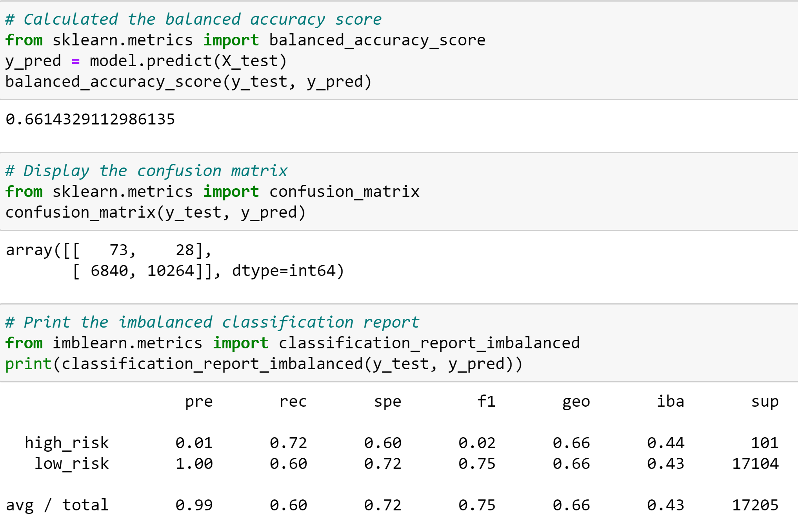
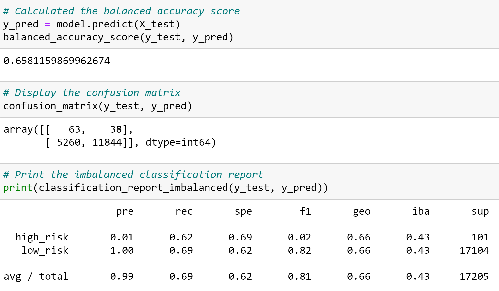
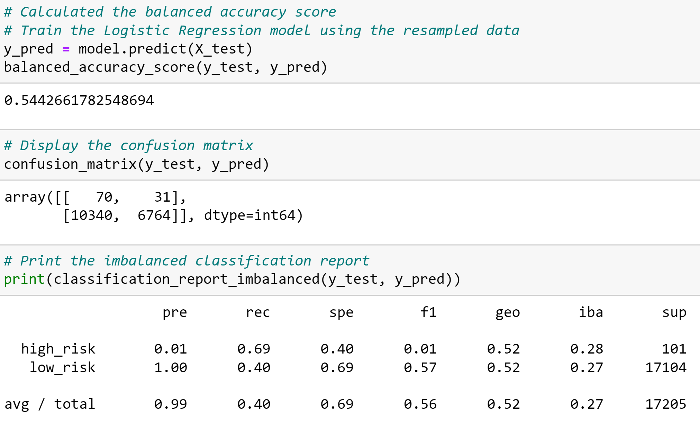
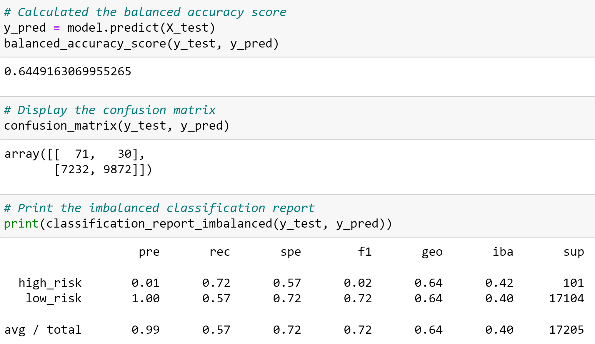
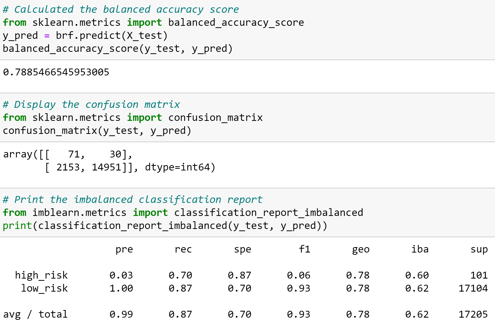
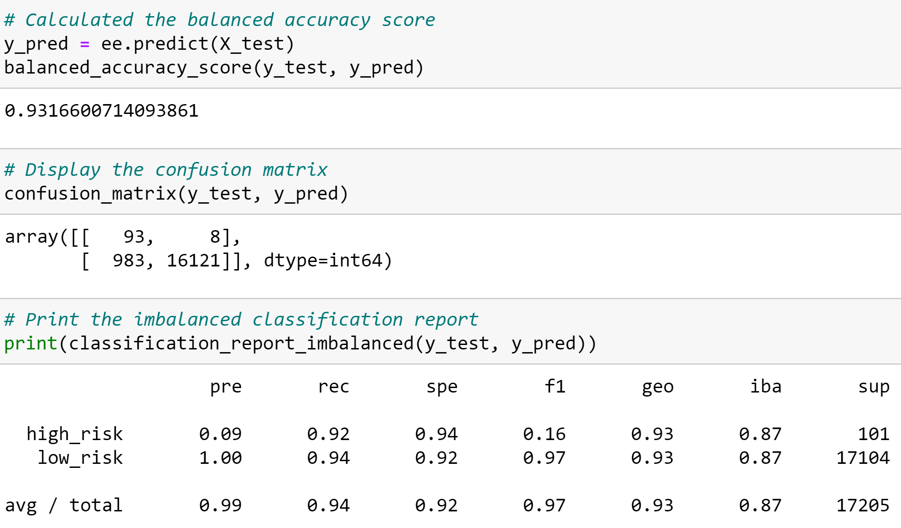

# Credit Risk Analysis
## Project Overview

## Results
#### Random Oversampling
  
  

#### SMOTE Oversampling

  

#### Cluster Centroids Undersampling

  

#### SMOTEEN Combination Sampling

  

#### Balanced Random Forest Classifier

  

#### Easy Ensemble Classifier

  

## Summary 